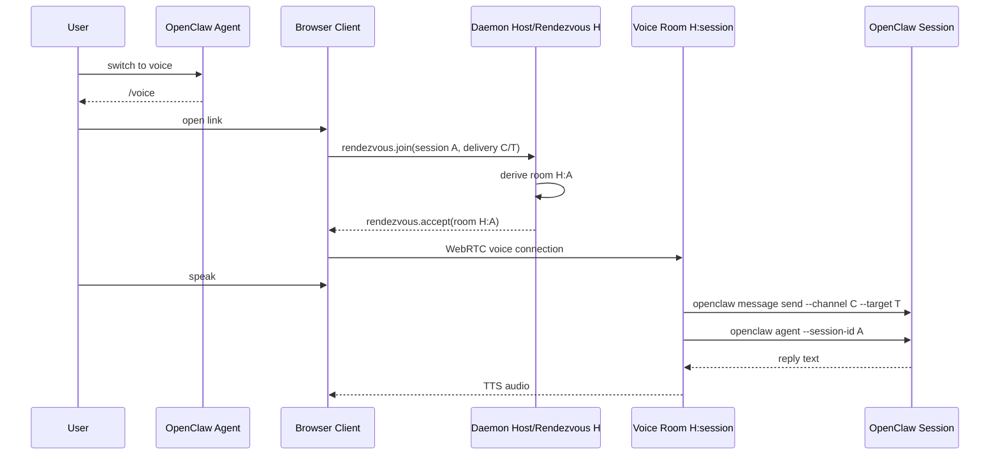

# Rendezvous Voice Handoff Implementation Plan

> **For Claude:** REQUIRED SUB-SKILL: Use superpowers:executing-plans to implement this plan task-by-task.

**Goal:** Make Clawkie-Talkie support OpenClaw agents handing any active session to voice by using one durable local daemon as a rendezvous/control host and deriving one deterministic voice room per OpenClaw session.

**Architecture:** Agents construct a ClawkieTalkie URL directly from values already present in the current OpenClaw turn: daemon `host`, OpenClaw `session`, delivery `channel`, and delivery `target`. The URL is hash-first (`/voice#...`) so UUIDs/session values are not sent to web servers; query params remain supported for compatibility. The browser joins the daemon rendezvous room `host=H`, sends those values once, then moves to a deterministic per-session voice room such as `H:<sessionKey>`. Actual voice/STT/TTS/OpenClaw turns happen on the per-session room.

**Tech Stack:** TypeScript, React/Vite client, Node/tsx daemon, simple-peer + `@roamhq/wrtc`, rambly-style signaling, Vitest, OpenClaw CLI integration.

---

## Critical Correction From the Thread

This plan intentionally avoids the stateful link-creation design that was rejected.

Do **not** implement:

- random join identifiers
- a pre-created link-state table
- a separate mapping table from link ID to session/thread/room
- local daemon API calls that mutate daemon state just to create a link
- TTL/revocation/claim state for link records
- a central gateway/session store
- one daemon per handoff
- a separate hosted/cloud gateway
- a helper command whose only job is turning known params into a URL

The agreed shape is simpler:

1. The daemon has stable rendezvous/control host ID `H`.
2. The agent creates a URL directly for the current conversation:
   - preferred: `https://clawkietalkie.app/voice#host=H&session=<sessionId>&channel=<channel>&target=<target>`
   - compatibility: `https://clawkietalkie.app/voice?host=H&session=<sessionId>&channel=<channel>&target=<target>`
3. The browser connects to rendezvous room `H`.
4. The browser sends `sessionId`, `channel`, and `target` to the daemon once during rendezvous.
5. The daemon derives the voice room deterministically, e.g. `H:<sessionKey>`.
6. The browser connects to that room.
7. Voice turns for A and B are isolated because they use different derived rooms.

The only daemon state should be runtime connection state for active voice rooms, e.g. `roomId -> VoiceSession`, because active WebRTC/STT/TTS sessions necessarily need live objects. That is different from pre-created link state.

---

## URL and App Routing Requirements

Public URL shape:

```txt
https://clawkietalkie.app/voice#host=<host>&session=<sessionId>&channel=<channel>&target=<target>
```

Rules:

- `/` is reserved for a marketing landing page.
- The voice app HTML lives at `/voice.html`.
- `/voice` must be supported as the nice user-facing path.
- `/voice` must preserve both query and hash args when loading/redirecting to `/voice.html`.
- Handoff args must be accepted from both hash fragments and query params.
- Agents should construct hash-fragment URLs by default so `host`, `session`, `channel`, and `target` are not sent in HTTP requests.
- If a key exists in both hash and query, hash wins.
- All values must be URL-encoded.

Required handoff args:

- `host`: stable Clawkie daemon rendezvous/control host ID.
- `session`: current OpenClaw session key/id, passed later to `openclaw agent --session-id`.
- `channel`: OpenClaw delivery channel, passed later to `openclaw message send --channel`.
- `target`: OpenClaw provider-specific delivery target, passed later to `openclaw message send --target`.

Example for this Discord thread:

```txt
https://clawkietalkie.app/voice#host=H&session=agent%3Amain%3Adiscord%3Achannel%3A1498020851298209852&channel=discord&target=channel%3A1498020851298209852
```

---

## Context From Thread

The intended user flow:

1. User is in an OpenClaw session on any channel/surface.
2. User says “switch to voice.”
3. Agent posts a ClawkieTalkie `/voice#...` link built from the current session context.
4. User opens the link.
5. User speaks on the Clawkie page.
6. Clawkie transcribes speech, mirrors the transcript into the originating OpenClaw conversation, runs the OpenClaw session, and speaks the reply back on the page.

The key repo-backed blocker:

- Current daemon is single-session / one phone at a time.
  - `daemon/README.md` says “Single-session daemon” and “accepts one phone WebRTC DataChannel at a time.”
  - `daemon/src/peer.ts` stores singleton `peer`, `remoteId`, `activeSessionId`, `activeThreadId`, `stt`, `tts`, `chatAbort`, and `turnInFlight` fields.
  - `daemon/src/peer.ts` rejects a second connected phone with `rejecting second phone ... one at a time`.
- Current `host` is the actual signaling room.
  - `client/src/rtc/client.ts` creates `SignalClient({ roomName: opts.hostPeerId })`.
  - `daemon/src/peer.ts` creates `SignalClient({ roomName: opts.peerId })`.
- Current browser sends routing fields at turn start.
  - `client/src/voice/sttDaemon.ts` sends `stt.start(sessionId, threadId)`.
  - `daemon/src/peer.ts` accepts those values and assigns singleton `activeSessionId` / `activeThreadId`.

User-facing production problem:

- Thread A asks “switch to voice” and gets link A.
- Thread B asks “switch to voice” and gets link B.
- Both links target the same daemon host.
- User expects Discord-like independent voice sessions.
- Today, both are trying to use the same singleton phone/WebRTC lane.

Target shape:

- One durable local Clawkie daemon.
- `host=H` is coordination/rendezvous identity, not the single voice lane.
- `session` determines the OpenClaw session the user wants.
- `channel` and `target` determine where transcript mirroring goes.
- Daemon derives a stable per-session `roomId` from `host` + `session`.
- Multiple voice rooms can coexist: A, B, C.
- `stt.start` no longer carries routing each turn; routing is bound once when the per-session room is created.

## Non-Goals

- Do not implement “one daemon per handoff.”
- Do not build a separate hosted/cloud gateway.
- Do not merge Clawkie into OpenClaw core.
- Do not add a pre-created link-state store or random join-ID lifecycle.
- Do not require agents to start/kill/manage Node daemons per handoff.
- Do not add a URL-formatting helper script or daemon API call. The agent formats the URL directly.
- Do not run `npm run dev`, `npm run daemon`, or other long-running Node servers during implementation unless David explicitly asks. Use tests/typecheck/build for verification.

---

## Task 1: Move the voice app to `/voice.html` and support `/voice`

**Files:**
- Rename: `client/index.html` -> `client/voice.html`
- Create: `client/index.html`
- Create: `client/voice/index.html`
- Modify: `client/vite.config.ts`
- Modify/Create tests as needed: `test/appEntry.test.ts` or existing routing tests

**Step 1: Write failing entrypoint checks**

Add a test or static assertion that verifies:

- `client/index.html` exists and is marketing/root shell, not the React voice app shell.
- `client/voice.html` exists and loads the React voice app entry.
- `client/voice/index.html` preserves `location.search` and `location.hash` when redirecting/loading `/voice.html`.

Expected redirect behavior:

```js
const next = '/voice.html' + window.location.search + window.location.hash;
window.location.replace(next);
```

**Step 2: Run the failing check**

```bash
cd /mnt/data/play/web/clawkie-talkie
npm test -- test/appEntry.test.ts
```

Expected: FAIL until the files are changed.

**Step 3: Move app HTML**

Move the existing React app HTML from `client/index.html` to `client/voice.html`.

Create a simple root `client/index.html` marketing placeholder. Keep it minimal; this plan is not the marketing-page design.

Create `client/voice/index.html` as a tiny redirect/preserve page for `/voice`:

```html
<!doctype html>
<html>
  <head>
    <meta charset="UTF-8" />
    <title>ClawkieTalkie Voice</title>
    <script>
      location.replace('/voice.html' + location.search + location.hash);
    </script>
  </head>
  <body>
    <a id="fallback" href="/voice.html">Continue to voice</a>
    <script>
      document.getElementById('fallback').href = '/voice.html' + location.search + location.hash;
    </script>
  </body>
</html>
```

**Step 4: Update Vite multi-page build**

Update `client/vite.config.ts` so Vite builds all HTML entrypoints:

```ts
import { resolve } from 'node:path';

export default defineConfig({
  // existing config...
  build: {
    rollupOptions: {
      input: {
        main: resolve(__dirname, 'index.html'),
        voice: resolve(__dirname, 'voice.html'),
        voicePath: resolve(__dirname, 'voice/index.html'),
      },
    },
  },
});
```

Preserve existing `plugins`, `define`, `resolve`, `optimizeDeps`, and `server` settings.

**Step 5: Verify**

```bash
npm test -- test/appEntry.test.ts
npm run build
```

Expected: PASS. Build output should include `index.html`, `voice.html`, and `voice/index.html` or equivalent static output for `/voice`.

**Step 6: Commit**

```bash
git add client/index.html client/voice.html client/voice/index.html client/vite.config.ts test/appEntry.test.ts
git commit -m "feat: add voice entrypoint and marketing root"
```

---

## Task 2: Add hash-first handoff URL parsing

**Files:**
- Modify: `client/src/app.tsx`
- Create or modify: `client/src/voice/handoffUrl.ts`
- Modify: `test/appRouting.test.ts`

**Step 1: Write failing URL parsing tests**

Update `test/appRouting.test.ts` or create focused tests for `parseHandoffUrl`:

```ts
it('parses handoff args from hash fragment', () => {
  expect(
    parseHandoffUrl('/voice#host=host-1&session=session-1&channel=discord&target=channel%3Athread-1'),
  ).toEqual({
    hostPeerId: 'host-1',
    sessionId: 'session-1',
    delivery: { channel: 'discord', target: 'channel:thread-1' },
  });
});

it('parses handoff args from query params for compatibility', () => {
  expect(
    parseHandoffUrl('/voice?host=host-1&session=session-1&channel=discord&target=channel%3Athread-1'),
  ).toMatchObject({
    hostPeerId: 'host-1',
    sessionId: 'session-1',
    delivery: { channel: 'discord', target: 'channel:thread-1' },
  });
});

it('prefers hash args over query args', () => {
  expect(
    parseHandoffUrl('/voice?host=query-host&session=query-session&channel=discord&target=channel%3Aquery#host=hash-host&session=hash-session&channel=slack&target=channel%3Ahash'),
  ).toMatchObject({
    hostPeerId: 'hash-host',
    sessionId: 'hash-session',
    delivery: { channel: 'slack', target: 'channel:hash' },
  });
});
```

**Step 2: Run failing tests**

```bash
npm test -- test/appRouting.test.ts
```

Expected: FAIL until hash parsing and generic delivery fields exist.

**Step 3: Implement parser**

Create `client/src/voice/handoffUrl.ts`:

```ts
export interface HandoffRoute {
  hostPeerId: string;
  sessionId: string;
  delivery: {
    channel: string;
    target: string;
  };
}

export function parseHandoffUrl(raw: string): HandoffRoute | null {
  const url = new URL(raw, 'https://clawkietalkie.app');
  const query = url.searchParams;
  const hashText = url.hash.startsWith('#') ? url.hash.slice(1) : url.hash;
  const hash = new URLSearchParams(hashText);

  const get = (key: string) => hash.get(key) || query.get(key) || '';
  const hostPeerId = get('host').trim();
  const sessionId = get('session').trim();
  const channel = get('channel').trim();
  const target = get('target').trim();

  if (!hostPeerId || !sessionId || !channel || !target) return null;

  return {
    hostPeerId,
    sessionId,
    delivery: { channel, target },
  };
}
```

Update `client/src/app.tsx` to use this parser for `/voice`, `/voice.html`, and compatible old query URLs.

**Step 4: Verify**

```bash
npm test -- test/appRouting.test.ts
npm run typecheck
```

Expected: PASS.

**Step 5: Commit**

```bash
git add client/src/app.tsx client/src/voice/handoffUrl.ts test/appRouting.test.ts
git commit -m "feat: parse hash-based voice handoff urls"
```

---

## Task 3: Add deterministic voice room derivation

**Files:**
- Create: `daemon/src/voiceRoom.ts`
- Create: `client/src/rtc/voiceRoom.ts`
- Create: `test/voiceRoom.test.ts`

**Step 1: Write failing tests**

Create `test/voiceRoom.test.ts`:

```ts
import { describe, expect, it } from 'vitest';
import { makeVoiceRoomId as daemonMakeVoiceRoomId } from '../daemon/src/voiceRoom';
import { makeVoiceRoomId as clientMakeVoiceRoomId } from '../client/src/rtc/voiceRoom';

describe('voice room derivation', () => {
  it('derives the same room id in daemon and client code', () => {
    const input = {
      hostPeerId: 'host-123',
      sessionId: 'agent:main:discord:channel:1498020851298209852',
    };

    expect(daemonMakeVoiceRoomId(input)).toBe('host-123:agent_main_discord_channel_1498020851298209852');
    expect(clientMakeVoiceRoomId(input)).toBe(daemonMakeVoiceRoomId(input));
  });

  it('keeps different sessions in different rooms', () => {
    expect(
      daemonMakeVoiceRoomId({ hostPeerId: 'host-123', sessionId: 'session-a' }),
    ).not.toBe(
      daemonMakeVoiceRoomId({ hostPeerId: 'host-123', sessionId: 'session-b' }),
    );
  });
});
```

**Step 2: Run test to verify it fails**

```bash
npm test -- test/voiceRoom.test.ts
```

Expected: FAIL because the files do not exist.

**Step 3: Implement room derivation**

Create `daemon/src/voiceRoom.ts` and `client/src/rtc/voiceRoom.ts` with matching code:

```ts
export interface VoiceRoomInput {
  hostPeerId: string;
  sessionId: string;
}

export function makeVoiceRoomId(input: VoiceRoomInput): string {
  return `${input.hostPeerId}:${safeRoomSegment(input.sessionId)}`;
}

export function safeRoomSegment(value: string): string {
  return value
    .trim()
    .replace(/[^a-zA-Z0-9_-]+/g, '_')
    .replace(/^_+|_+$/g, '')
    .slice(0, 160);
}
```

Important: keep this deterministic. Do not generate random IDs. Do not store mapping state.

**Step 4: Verify**

```bash
npm test -- test/voiceRoom.test.ts
```

Expected: PASS.

**Step 5: Commit**

```bash
git add daemon/src/voiceRoom.ts client/src/rtc/voiceRoom.ts test/voiceRoom.test.ts
git commit -m "feat: derive deterministic voice rooms"
```

---

## Task 4: Add rendezvous join protocol with generic delivery

**Files:**
- Modify: `daemon/src/protocol.ts`
- Modify: `client/src/voice/protocol.ts`
- Modify: `test/protocol.test.ts`

**Step 1: Write failing protocol tests**

Update `test/protocol.test.ts`:

```ts
expect(phoneClient.rendezvousJoin({
  sessionId: 'session-1',
  delivery: { channel: 'discord', target: 'channel:thread-1' },
})).toEqual({
  t: 'rendezvous.join',
  sessionId: 'session-1',
  delivery: { channel: 'discord', target: 'channel:thread-1' },
});

expect(daemonClient.rendezvousAccept('host-1:session-1')).toEqual({
  t: 'rendezvous.accept',
  roomId: 'host-1:session-1',
});

expect(daemonClient.rendezvousError('missing_session')).toEqual({
  t: 'rendezvous.error',
  message: 'missing_session',
});

expect(phoneClient.sttStart()).toEqual({ t: 'stt.start' });
```

Remove expectations that `stt.start` serializes `sessionId`, `threadId`, `channel`, or `target`.

**Step 2: Run test to verify it fails**

```bash
npm test -- test/protocol.test.ts
```

Expected: FAIL until protocol factories exist and `stt.start` no longer carries routing.

**Step 3: Update protocol files**

In both `daemon/src/protocol.ts` and `client/src/voice/protocol.ts`:

```ts
export interface DeliveryTarget {
  channel: string;
  target: string;
}

export type PhoneToDaemon =
  | { t: 'rendezvous.join'; sessionId: string; delivery: DeliveryTarget }
  | { t: 'stt.start' }
  | { t: 'stt.audio.done' }
  | { t: 'stt.cancel' }
  | { t: 'reply.cancel' };

export type DaemonToPhone =
  | { t: 'rendezvous.accept'; roomId: string }
  | { t: 'rendezvous.error'; message: string }
  | { t: 'stt.ready' }
  | { t: 'stt.partial'; text: string; is_final: boolean }
  | { t: 'stt.done'; text: string }
  | { t: 'stt.error'; message: string }
  | { t: 'stt.closed' }
  | { t: 'reply.start'; text: string }
  | { t: 'reply.done'; text: string }
  | { t: 'reply.error'; message: string }
  | { t: 'tts.start'; sample_rate: number }
  | { t: 'tts.done' }
  | { t: 'tts.error'; message: string };
```

Factories:

```ts
export const phoneToDaemon = {
  rendezvousJoin: (input: { sessionId: string; delivery: DeliveryTarget }): PhoneToDaemon => ({
    t: 'rendezvous.join',
    sessionId: input.sessionId,
    delivery: input.delivery,
  }),
  sttStart: (): PhoneToDaemon => ({ t: 'stt.start' }),
  sttAudioDone: (): PhoneToDaemon => ({ t: 'stt.audio.done' }),
  sttCancel: (): PhoneToDaemon => ({ t: 'stt.cancel' }),
  replyCancel: (): PhoneToDaemon => ({ t: 'reply.cancel' }),
};

export const daemonToPhone = {
  rendezvousAccept: (roomId: string): DaemonToPhone => ({ t: 'rendezvous.accept', roomId }),
  rendezvousError: (message: string): DaemonToPhone => ({ t: 'rendezvous.error', message }),
  // keep existing factories...
};
```

**Step 4: Verify**

```bash
npm test -- test/protocol.test.ts test/voiceRoom.test.ts
```

Expected: PASS.

**Step 5: Commit**

```bash
git add daemon/src/protocol.ts client/src/voice/protocol.ts test/protocol.test.ts
git commit -m "feat: add generic rendezvous join protocol"
```

---

## Task 5: Make OpenClaw chat delivery generic

**Files:**
- Modify: `daemon/src/chatSession.ts`
- Modify: `daemon/src/types.ts` if needed
- Modify: `test/chatSession.test.ts`

**Step 1: Write failing tests**

Update `test/chatSession.test.ts` so `runChat` accepts an explicit delivery target:

```ts
await runChat('hello', {
  apiKey: 'test-key',
  sessionId: 'session-1',
  delivery: { channel: 'slack', target: 'channel:C123' },
});

const transcriptCommand = String(execMock.mock.calls[0]?.[0]);
expect(transcriptCommand).toContain('openclaw "message" "send"');
expect(transcriptCommand).toContain('"--channel" "slack"');
expect(transcriptCommand).toContain('"--target" "channel:C123"');
```

Keep tests that verify the agent call is:

```bash
openclaw agent --session-id <sessionId> --message <voicePrompt>
```

and does **not** pass `--deliver`, `--reply-to`, or an explicit reply target.

**Step 2: Run failing tests**

```bash
npm test -- test/chatSession.test.ts
```

Expected: FAIL until generic delivery is supported.

**Step 3: Update chat session API**

Change `runChat` options to include:

```ts
export interface DeliveryTarget {
  channel: string;
  target: string;
}

export interface ChatOptionsWithSession extends ChatOptions {
  sessionId: string;
  delivery: DeliveryTarget;
}
```

Transcript mirror command becomes:

```ts
const args = [
  'message', 'send',
  '--channel', opts.delivery.channel,
  '--target', opts.delivery.target,
  '--message', quoteTranscript(transcript),
];
```

Remove Discord-only `threadId` assumptions from the normal path. If keeping compatibility helpers, mark them legacy and do not use them in rendezvous sessions.

Agent command remains:

```ts
const args = [
  'agent',
  '--session-id', sessionId,
  '--message', message,
];
```

**Step 4: Verify**

```bash
npm test -- test/chatSession.test.ts
npm run typecheck
```

Expected: PASS.

**Step 5: Commit**

```bash
git add daemon/src/chatSession.ts daemon/src/types.ts test/chatSession.test.ts
git commit -m "feat: use generic OpenClaw delivery targets"
```

---

## Task 6: Refactor daemon runtime into multiple `VoiceSession`s

**Files:**
- Create: `daemon/src/voiceSession.ts`
- Modify: `daemon/src/peer.ts`
- Create: `test/voiceSession.test.ts`

**Step 1: Write pure state tests**

Create `test/voiceSession.test.ts`:

```ts
import { describe, expect, it } from 'vitest';
import { createVoiceSessionState } from '../daemon/src/voiceSession';

describe('voice session state', () => {
  it('binds one room to one session and delivery target for its lifetime', () => {
    const s = createVoiceSessionState({
      roomId: 'host-1:session-1',
      sessionId: 'session-1',
      delivery: { channel: 'discord', target: 'channel:thread-1' },
    });

    expect(s.chatTarget()).toEqual({
      sessionId: 'session-1',
      delivery: { channel: 'discord', target: 'channel:thread-1' },
    });
    expect(s.roomId).toBe('host-1:session-1');
  });

  it('does not accept route changes on stt.start', () => {
    const s = createVoiceSessionState({
      roomId: 'host-1:session-1',
      sessionId: 'session-1',
      delivery: { channel: 'discord', target: 'channel:thread-1' },
    });

    s.handleStartTurn();

    expect(s.chatTarget().sessionId).toBe('session-1');
    expect(s.chatTarget().delivery.target).toBe('channel:thread-1');
  });
});
```

**Step 2: Run test to verify it fails**

```bash
npm test -- test/voiceSession.test.ts
```

Expected: FAIL because `daemon/src/voiceSession.ts` does not exist.

**Step 3: Add state core**

Create `daemon/src/voiceSession.ts`:

```ts
import type { DeliveryTarget } from './protocol';

export interface VoiceSessionConfig {
  roomId: string;
  sessionId: string;
  delivery: DeliveryTarget;
}

export function createVoiceSessionState(config: VoiceSessionConfig) {
  let turnInFlight = false;
  let closed = false;

  return {
    roomId: config.roomId,
    handleStartTurn() {
      turnInFlight = true;
    },
    resetTurn() {
      turnInFlight = false;
    },
    close() {
      closed = true;
    },
    get turnInFlight() {
      return turnInFlight;
    },
    get closed() {
      return closed;
    },
    chatTarget() {
      return { sessionId: config.sessionId, delivery: config.delivery };
    },
  };
}
```

**Step 4: Move runtime peer/STT/TTS/chat state out of singleton `DaemonPeer`**

Refactor `daemon/src/peer.ts` carefully:

- Keep one host/rendezvous `SignalClient` subscribed to `opts.peerId` / room `opts.peerId`.
- Replace singleton voice fields with active sessions:

```ts
private voiceSessions = new Map<string, VoiceSession>();
```

- `VoiceSession` owns:
  - its own room `SignalClient` with `roomName = roomId`
  - one phone peer for that room
  - `sessionId`
  - `delivery.channel`
  - `delivery.target`
  - `stt`
  - `tts`
  - `chatAbort`
  - `turnInFlight`
  - audio source/queue/pump/keepalive for that room

Keep behavior equivalent inside one session. The main change is that state is per room instead of global singleton.

**Step 5: Implement rendezvous handling in `DaemonPeer`**

When a browser connects to host room `H`:

1. Accept only `rendezvous.join` control message.
2. Validate `sessionId`, `delivery.channel`, and `delivery.target` are non-empty.
3. Derive `roomId = makeVoiceRoomId({ hostPeerId: opts.peerId, sessionId })`.
4. Create/start `VoiceSession` for `roomId` if it does not already exist.
5. Send `rendezvous.accept(roomId)` to the browser.
6. Close the host-room peer for that browser.

No pre-created link-state table. No random join-ID validation. No TTL state.

**Step 6: Route turns using room-bound session/delivery**

Inside `VoiceSession`, when it receives `stt.start`:

- do **not** read session/channel/target from the message;
- use the `sessionId` and `delivery` captured at room creation;
- call `runChat({ sessionId, delivery, ... })`.

**Step 7: Verify**

```bash
npm test -- test/voiceSession.test.ts test/protocol.test.ts test/voiceRoom.test.ts test/chatSession.test.ts
npm run typecheck
```

Expected: PASS.

**Step 8: Commit**

```bash
git add daemon/src/voiceSession.ts daemon/src/peer.ts test/voiceSession.test.ts
git commit -m "feat: split daemon voice state by session room"
```

---

## Task 7: Update browser flow to switch from rendezvous room to voice room

**Files:**
- Modify: `client/src/app.tsx`
- Modify: `client/src/rtc/RtcContext.tsx`
- Modify: `client/src/rtc/client.ts` if needed
- Modify: `client/src/screens/Handoff.tsx`
- Modify: `client/src/screens/Driving.tsx`
- Modify: `client/src/voice/sttDaemon.ts`
- Modify: `test/appRouting.test.ts`

**Step 1: Write flow tests**

Update routing/state tests so the browser stores:

```ts
{
  hostPeerId: 'host-1',
  sessionId: 'session-1',
  delivery: { channel: 'discord', target: 'channel:thread-1' },
}
```

and sends `rendezvous.join` before entering the voice room.

**Step 2: Implement two-phase browser connection**

Current browser connects directly to `hostPeerId` and uses that connection for voice.

Change it to:

1. Handoff screen connects to `hostPeerId` as the rendezvous room.
2. On user enter / start, send:

```ts
phoneToDaemon.rendezvousJoin({ sessionId, delivery })
```

3. Wait for `rendezvous.accept` with `roomId`.
4. Close rendezvous `RtcClient`.
5. Create a new `RtcClient` using `hostPeerId = roomId`.
6. Enter `DrivingScreen` using the voice-room connection.

Expose UI states clearly:

- `CONNECTING TO CLAWKIE`
- `JOINING SESSION ROOM`
- `READY`
- `SESSION JOIN FAILED`

**Step 3: Remove route IDs from `stt.start`**

In `client/src/voice/sttDaemon.ts`:

```ts
opts.sendControl(phoneToDaemon.sttStart());
```

Remove `sessionId`, `threadId`, `channel`, and `target` from `STTStartOptions` unless tests require temporary compatibility. If compatibility remains, do not use it in the normal rendezvous path.

**Step 4: Verify**

```bash
npm test -- test/appRouting.test.ts test/protocol.test.ts test/drivingReducer.test.ts
npm run typecheck
```

Expected: PASS.

**Step 5: Commit**

```bash
git add client/src/app.tsx client/src/rtc/RtcContext.tsx client/src/rtc/client.ts client/src/screens/Handoff.tsx client/src/screens/Driving.tsx client/src/voice/sttDaemon.ts test/appRouting.test.ts
git commit -m "feat: connect browser through rendezvous room"
```

---

## Task 8: Add active session cleanup and limits only for live voice sessions

**Files:**
- Modify: `daemon/src/voiceSession.ts`
- Modify: `daemon/src/peer.ts`
- Modify: `test/voiceSession.test.ts`

**Step 1: Write cleanup tests**

Add tests for pure cleanup behavior:

```ts
it('marks a voice session closed after cleanup', () => {
  const s = createVoiceSessionState({
    roomId: 'host:s1',
    sessionId: 's1',
    delivery: { channel: 'discord', target: 'channel:t1' },
  });
  expect(s.closed).toBe(false);
  s.close();
  expect(s.closed).toBe(true);
});
```

**Step 2: Implement runtime cleanup**

In runtime `VoiceSession`:

- destroy peer on close;
- close room `SignalClient`;
- cancel STT/TTS/chat abort;
- stop keepalive/audio pump;
- notify manager when session closes;
- manager removes `voiceSessions.delete(roomId)`.

Add max active sessions only to prevent resource runaway:

```ts
private readonly maxVoiceSessions = opts.maxVoiceSessions ?? 8;
```

If exceeded, rendezvous returns `rendezvous.error('too_many_voice_sessions')`.

Important: this is active runtime session state only. It is not pre-created link state.

**Step 3: Verify**

```bash
npm test -- test/voiceSession.test.ts test/protocol.test.ts
npm run typecheck
```

Expected: PASS.

**Step 4: Commit**

```bash
git add daemon/src/voiceSession.ts daemon/src/peer.ts test/voiceSession.test.ts
git commit -m "feat: clean up active voice sessions"
```

---

## Task 9: Update docs for deterministic rendezvous and agent-built URLs

**Files:**
- Modify: `daemon/README.md`
- Create: `docs/voice-handoff.md`
- Update if present: agent/skill docs that describe Clawkie voice handoff

**Step 1: Update daemon README**

Replace “Single-session daemon” framing with:

- daemon is a local rendezvous daemon;
- `host` is a control/rendezvous room;
- voice happens on deterministic per-session rooms;
- agents construct `/voice#host=...&session=...&channel=...&target=...` directly;
- `/voice` is the public handoff path;
- `/voice.html` is the app HTML path;
- `/` is reserved for the marketing landing page;
- hash args are preferred so handoff identifiers are not sent to web servers;
- query params are accepted for compatibility;
- no pre-created link-state lifecycle exists.

Document daemon startup only, not link-helper startup:

```bash
npm run daemon -- \
  --client-origin https://clawkietalkie.app
```

**Step 2: Create design doc**

Create `docs/voice-handoff.md` with:

- user story;
- old singleton architecture;
- new deterministic rendezvous architecture;
- URL contract;
- hash-vs-query privacy note;
- app route contract (`/`, `/voice`, `/voice.html`);
- sequence diagram;
- failure states;
- testing checklist.

Suggested Mermaid:



**Step 3: Verify docs-adjacent checks**

```bash
npm run typecheck
npm test
```

Expected: PASS.

**Step 4: Commit**

```bash
git add daemon/README.md docs/voice-handoff.md
git commit -m "docs: describe deterministic voice handoff urls"
```

---

## Task 10: Add integration-style test for two simultaneous sessions

**Files:**
- Create: `test/multiSessionRendezvous.test.ts`
- Create if useful: `daemon/src/voiceSessionManager.ts`
- Create if useful: `test/voiceSessionManager.test.ts`

**Step 1: Write state/protocol-level test**

Do not require real WebRTC in CI. Test the manager behavior with fake voice sessions.

Desired behavior:

```ts
describe('multi-session rendezvous', () => {
  it('derives separate rooms for separate sessions on the same host', () => {
    const host = 'host-1';
    const roomA = makeVoiceRoomId({ hostPeerId: host, sessionId: 'session-a' });
    const roomB = makeVoiceRoomId({ hostPeerId: host, sessionId: 'session-b' });

    expect(roomA).toBe('host-1:session-a');
    expect(roomB).toBe('host-1:session-b');
    expect(roomA).not.toBe(roomB);
  });

  it('keeps chat targets isolated by room', () => {
    const a = createVoiceSessionState({
      roomId: 'host-1:session-a',
      sessionId: 'session-a',
      delivery: { channel: 'discord', target: 'channel:thread-a' },
    });
    const b = createVoiceSessionState({
      roomId: 'host-1:session-b',
      sessionId: 'session-b',
      delivery: { channel: 'slack', target: 'channel:C123' },
    });

    expect(a.chatTarget()).toEqual({
      sessionId: 'session-a',
      delivery: { channel: 'discord', target: 'channel:thread-a' },
    });
    expect(b.chatTarget()).toEqual({
      sessionId: 'session-b',
      delivery: { channel: 'slack', target: 'channel:C123' },
    });
  });
});
```

If `DaemonPeer` is too coupled to WebRTC to test directly, extract a pure `VoiceSessionManager`:

- Create: `daemon/src/voiceSessionManager.ts`
- Test: `test/voiceSessionManager.test.ts`

Manager responsibilities:

- derive room from host/session;
- create/get active `VoiceSession` by room;
- enforce max active sessions;
- remove sessions on cleanup.

**Step 2: Verify**

```bash
npm test -- test/multiSessionRendezvous.test.ts test/voiceSession.test.ts test/voiceRoom.test.ts
npm run typecheck
```

Expected: PASS.

**Step 3: Commit**

```bash
git add daemon/src/voiceSessionManager.ts test/multiSessionRendezvous.test.ts test/voiceSessionManager.test.ts
git commit -m "test: cover multi-session rendezvous"
```

---

## Task 11: Final verification gate

**Files:**
- No new files unless fixing failures.

**Step 1: Run full automated checks**

```bash
cd /mnt/data/play/web/clawkie-talkie
npm test
npm run typecheck
npm run build
```

Expected:

- Vitest passes.
- TypeScript passes for client and daemon.
- Vite build succeeds.

**Step 2: Inspect git diff**

```bash
git status --short
git diff --stat
```

Expected:

- Only intended files changed.
- No `.env`, `node_modules`, build artifacts, or credentials committed.

**Step 3: Optional live verification only if David explicitly asks**

Because this requires running Node server/daemon processes, do not do it silently.

If authorized, verify:

1. Start existing project dev flow in the approved way.
2. Create link A for session A using hash args.
3. Create link B for session B using hash args.
4. Open both links in separate browser tabs/devices.
5. Confirm both reach READY independently.
6. Speak one deterministic fixture or mic turn in A.
7. Confirm transcript/reply mirrors to A only.
8. Speak one turn in B.
9. Confirm transcript/reply mirrors to B only.
10. Confirm closing A does not close B.

---

## Completion Criteria

The feature is complete when:

- `npm test` passes.
- `npm run typecheck` passes.
- `npm run build` passes.
- `/` is a marketing landing page entrypoint.
- `/voice` is a supported user-facing voice handoff path.
- `/voice.html` is the voice app HTML path.
- Browser accepts handoff args from hash fragments and query params.
- Agents construct hash-fragment URLs by default.
- `host=H` is rendezvous/control only.
- The actual voice WebRTC session uses a derived per-session room.
- Daemon can hold at least two simultaneous independent voice sessions.
- Each voice session has its own room-bound `sessionId` and `delivery.channel/target` for chat routing.
- `stt.start` no longer accepts or sets routing fields per turn.
- There is no pre-created link-state table / random join-ID store / TTL lifecycle for link creation.
- There is no helper script/API whose only job is formatting the URL.
- Docs describe deterministic rendezvous accurately.

## Recommended Commit Sequence

1. `feat: add voice entrypoint and marketing root`
2. `feat: parse hash-based voice handoff urls`
3. `feat: derive deterministic voice rooms`
4. `feat: add generic rendezvous join protocol`
5. `feat: use generic OpenClaw delivery targets`
6. `feat: split daemon voice state by session room`
7. `feat: connect browser through rendezvous room`
8. `feat: clean up active voice sessions`
9. `docs: describe deterministic voice handoff urls`
10. `test: cover multi-session rendezvous`

## Execution Notes

- Work in `/mnt/data/play/web/clawkie-talkie` on the current branch unless David explicitly asks for a worktree.
- This is a local-only/pre-release project; do not create a worktree by default.
- Do not push unless David explicitly asks.
- Do not commit credentials.
- Do not start or kill Node servers during automated implementation unless David explicitly authorizes live verification.
- Prefer small commits after each task.
- If implementation reveals that deterministic rooms cannot work with the current signaling server semantics, stop and report that exact blocker before adding stateful handoff machinery.
