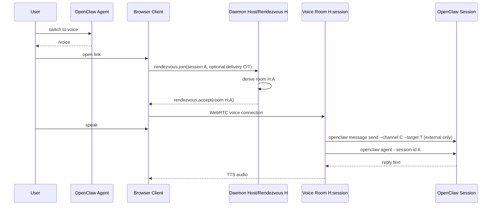

# Voice Handoff (Deterministic Rendezvous)

## User story

1. User is in an OpenClaw session on any channel/surface.
2. User says "switch to voice".
3. The agent posts a Clawkie-Talkie `/voice#…` link built directly from the
   current OpenClaw turn — no helper script, no daemon API call, no
   pre-created link record.
4. User opens the link.
5. User speaks. Clawkie transcribes, optionally mirrors the transcript into
   the originating external conversation, runs the OpenClaw session, and speaks
   the reply back.

## Old singleton architecture

Before this design the daemon was single-session: one phone at a time, one
shared `activeSessionId` / `activeThreadId`, one set of WebRTC/STT/TTS
singletons. Two threads asking the user to "switch to voice" produced two
links to the same lane and stomped on each other.

## Deterministic rendezvous

There is now exactly one durable local daemon. `host=H` is a stable
rendezvous/control identity, not the voice lane.

For each handoff the agent fills the URL with values already present in the
turn. External deliveries include `target`; webchat/internal session-only links
omit it:

```
https://clawkietalkie.app/voice#host=H&session=<sessionId>&channel=<channel>&target=<target>
https://clawkietalkie.app/voice#host=H&session=agent:main:main&channel=webchat
```

The browser:

1. Joins the rendezvous room `H`.
2. Sends `rendezvous.join { sessionId, delivery?: { channel, target? } }` once.
   For webchat/internal session-only links, `delivery` may be absent or may be
   `{ channel: "webchat" }` with no `target`.
3. Receives `rendezvous.accept { roomId }`, where
   `roomId = makeVoiceRoomId({ hostPeerId: H, sessionId })`.
4. Reconnects to `roomId` and runs the voice turn there.

The daemon derives the same `roomId` deterministically. There is no
pre-created link record, random join id, TTL, claim, revocation, or central
session store.

The only daemon state that survives between turns is `roomId -> VoiceSession`
for actively connected voice rooms — necessary because WebRTC/STT/TTS need
live objects.

## TTS and STT catalogs and settings

The daemon is the source of truth for both TTS (speech output) and STT
(transcription input) provider metadata. After the browser opens the
per-session voice room, it requests both catalogs once:

- `tts.catalog.request` → daemon loads `openclaw infer tts providers --json` and
  replies with `tts.catalog`.
- `stt.catalog.request` → daemon loads `openclaw infer audio providers --json`
  and replies with `stt.catalog`.

Both catalogs are normalized and sent over the WebRTC DataChannel.

Phone settings store only ids — `tts: { providerId, model, voice }` and
`stt: { providerId, model }`. They do not store provider credentials or
provider-specific auth material. The phone selects TTS and STT independently:
choosing OpenAI for TTS does not pin transcription to OpenAI, and vice versa.

The phone communicates selections to the daemon over the same voice room:

- An initial selection is included in `rendezvous.join { settings: {…} }`.
- Subsequent changes flow as `settings.update { settings: { tts?, stt?, voice? } }`.

The daemon applies selections per request:

- TTS: `openclaw infer tts convert --model <provider>/<model> --voice <voice>`
  (model and voice are passed only when both fields are non-empty).
- STT: `openclaw infer audio transcribe --file <wav> --json --model
  <provider>/<model>` (model is passed only when both provider and model are
  non-empty; the optional `--language` hint is preserved).

Clawkie Talkie must not call `openclaw infer tts set-provider`, an equivalent
global audio set-provider, or any other command that mutates OpenClaw's global
provider preferences. If OpenClaw reports a provider but does not expose a
model id that can be passed to `--model`, the settings UI should hide or
disable that provider instead of falling back to global provider mutation.

## URL contract

- `/` — marketing landing page placeholder.
- `/voice/` — canonical public user-facing voice handoff path. Static hosts
  serve this from `/voice/index.html`.
- `/voice.html` — compatibility redirect to `/voice/`, preserving both `?…`
  and `#…`.

Required handoff args (accepted from hash fragment, then query string):

- `host` — daemon rendezvous/control room id
- `session` — OpenClaw session key/id, passed later to
  `openclaw agent --session-id`. For webchat-only handoffs, use
  `agent:main:main` when no more specific exact key is visible; the daemon runs
  `openclaw agent --agent main --session-id agent:main:main --channel last --deliver`.
  Older `agent:main:webchat` links are normalized to this webchat session-only form.
- `channel` — source channel/surface. For external delivery this is passed later to
  `openclaw message send --channel`.
- `target` — optional OpenClaw delivery target. For external delivery, this is
  required and passed later to `openclaw message send --target`. For
  webchat/internal session-only links, omit `target`; the daemon does not call
  `openclaw message send` and uses OpenClaw channel-last delivery for the agent turn.

Hash wins over query when both are present. All values must be URL-encoded.

Examples:

```
https://clawkietalkie.app/voice#host=H&session=S&channel=discord&target=channel%3A123
https://clawkietalkie.app/voice#host=H&session=S&channel=webchat
```

### Why hash-first?

Hash fragments are not transmitted on HTTP requests, so `host`, `session`,
`channel`, and `target` never reach a web server. The browser parses them
locally and sends them only over the encrypted WebRTC DataChannel to the
local daemon.

## Sequence



## Failure states

- `rendezvous.error("missing_session")` — required session field missing.
- `rendezvous.error("invalid_delivery")` — external delivery is partial;
  use either no delivery, webchat delivery without target, or a complete
  external channel+target.
- `rendezvous.error("too_many_voice_sessions")` — daemon at active-room cap
  and the requested session is not already active.
- `rendezvous.error("unexpected_message")` — first message on the rendezvous
  lane was not `rendezvous.join`.

## Testing checklist

- `npm test` — unit/contract tests including `voiceRoom`, `voiceSession`,
  `protocol`, `chatSession`, `appRouting`, `appEntry`,
  `multiSessionRendezvous`.
- `npm run typecheck` — client and daemon TypeScript.
- `npm run build` — Vite multi-page build emits `/`, canonical
  `/voice/index.html`, and the `/voice.html` compatibility redirect.
- `openclaw infer tts providers --json` — catalog includes at least one
  configured provider.
- `openclaw infer audio providers --json` — bare-array audio provider catalog
  includes at least one configured provider with a `defaultModels.audio` value.
- `openclaw infer tts convert --text "catalog smoke" --output
  /tmp/clawkie-tts-smoke.mp3 --json --local --model openai/gpt-4o-mini-tts
  --voice nova` — explicit per-request TTS smoke returns JSON with an output
  path and does not require `openclaw infer tts set-provider`.
- `openclaw infer audio transcribe --file <fixture.wav> --json --model
  <configured-provider>/<model>` — explicit per-request STT smoke returns JSON
  with a transcript text and does not mutate OpenClaw's global audio provider.
- Live verification (only with explicit authorization): two simultaneous
  `/voice#…` links pointing at the same `host=H` but different `session`
  values must reach READY independently and not cross-talk.
